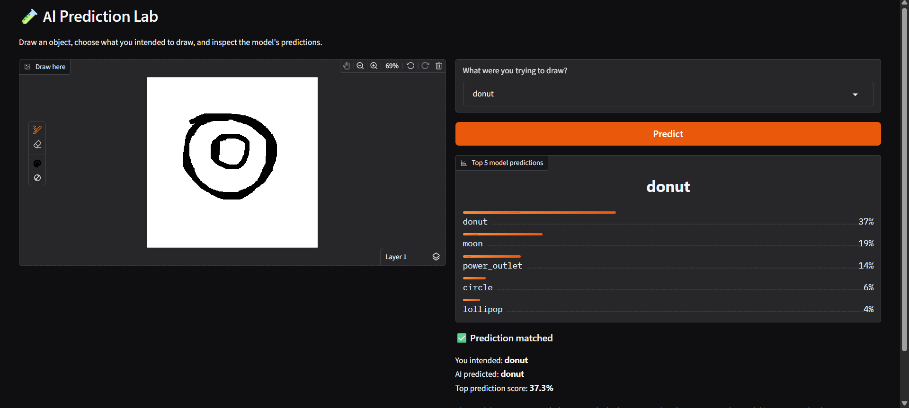
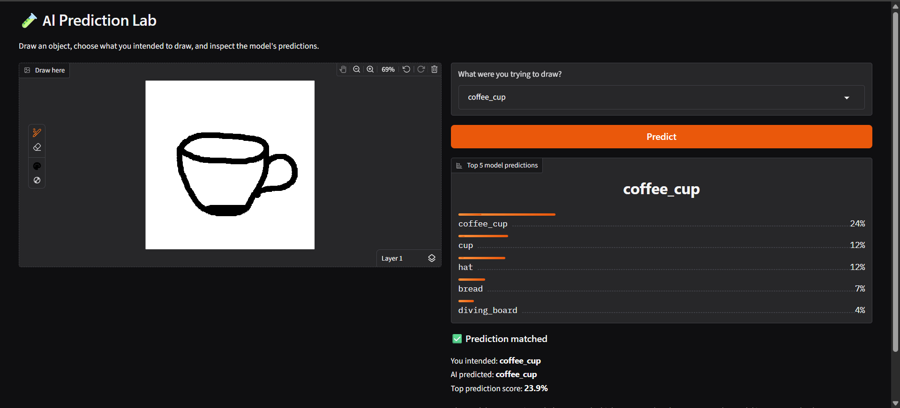
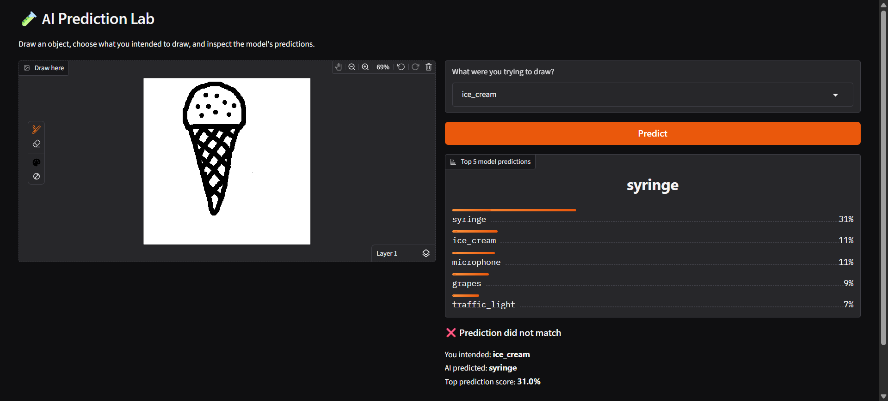
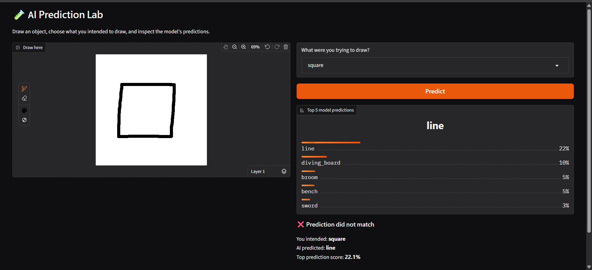

# 🎨 AI Prediction Lab - Hand-Drawn Sketch Classifier

An interactive AI web application built with **Python, Gradio, PyTorch, and Hugging Face** that predicts what object a user is drawing in real time.

This project uses a **pretrained QuickDraw image classification model** to recognize simple hand-drawn sketches and display the **Top 5 predictions** with confidence scores.

---

## 🚀 Project Overview

The AI Prediction Lab allows users to draw an object on a canvas and see how an AI model interprets the drawing.

Instead of relying on manually written rules, the model recognizes **visual patterns** learned from thousands of labeled sketches in the Google QuickDraw dataset.

This project demonstrates the basics of **Computer Vision** and **Image Classification** using a pretrained neural network.

---

## ✨ Features

* 🎨 Draw objects directly on a browser canvas.
* 🤖 Predict the drawn object using a pretrained AI model.
* 📊 Display the **Top 5 predictions** with confidence scores.
* ✅ Compare the AI prediction with the user's intended object.
* ❌ Explore cases where the AI makes incorrect predictions.

---

## 🧠 How It Works

1. Draw an object on the canvas.
2. Select what you intended to draw.
3. Click **Predict**.
4. The application preprocesses the drawing into a 28×28 grayscale image.
5. A pretrained **QuickDraw CNN model** predicts the object category.
6. The app displays the prediction, confidence score, and whether it matched your intended object.

---

## 🖼️ Demo

### 🍩 Correct Prediction — Donut



The AI successfully recognized a hand-drawn donut and ranked it as the top prediction.

---

### 👓 Correct Prediction — Eyeglasses



The AI successfully recognized a hand-drawn Coffe Cup and ranked it as the top prediction.

---

### 🍦 Incorrect Prediction — Ice Cream



The AI predicted **syringe** instead of **ice_cream**, showing how similar shapes can confuse image classification models.

---

### ⬜ Incorrect Prediction — Square



The AI predicted **line** instead of **square**, demonstrating that confidence does not always mean correctness.

---

## 🛠️ Tech Stack

* Python 3
* Gradio
* PyTorch
* Hugging Face Hub
* NumPy
* Pillow (PIL)

---

## 📂 Project Structure

```text
ai-prediction-lab/
├── assets/
│   ├── donut_prediction.png
│   ├── coffeecup_prediction.png
│   ├── icecream_prediction.png
│   └── square_prediction.png
├── app.py
├── requirements.txt
├── README.md
└── .gitignore
```

---

## ⚙️ Installation

Clone the repository:

```bash
git clone https://github.com/satwika1112/ai-prediction-lab.git
cd ai-prediction-lab
```

Install the required packages:

```bash
pip install -r requirements.txt
```

Run the application:

```bash
python app.py
```

The app will open in your browser using Gradio.

---

## 📚 What I Learned

This project helped me understand:

* Basics of **Computer Vision** using image classification.
* How pretrained neural networks recognize visual patterns.
* The difference between AI confidence and prediction correctness.
* Image preprocessing using grayscale conversion and resizing.
* Building an interactive AI application using **Gradio** and **PyTorch**.

---

## 🎯 Future Improvements

Some ideas I plan to explore:

* Improve prediction accuracy with a better-trained model.
* Allow users to upload images instead of only drawing.
* Show prediction probabilities visually with charts.
* Deploy the application online using Hugging Face Spaces or Streamlit.

---

## 🌱 About This Project

This project was created as part of my **Python for AI learning journey**, where I'm exploring the fundamentals of Artificial Intelligence through hands-on projects and experiments.
